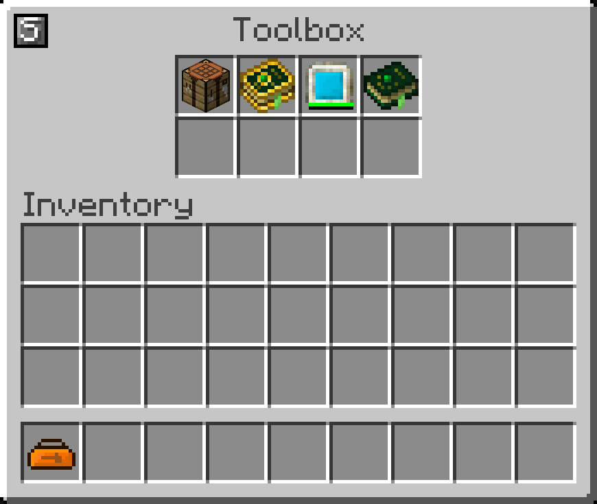

## Wanted Boxable
Wanted Boxable is a small mod for IC2Classic that allows you to specify what items can be boxable and can be stored in IC2Classic's ToolBox.

## Reason
The reason for this small tweak addon is that as of right now, there is a predefined list of items/prefixes that can be stored. Yet, some of other mods' items like Botania's Lexicon, Mana Tablets are not included. With this mod, you can add it. Now you can keep all your tools/items together!

## Credits
Full credit goes to IC2Classic Dev.